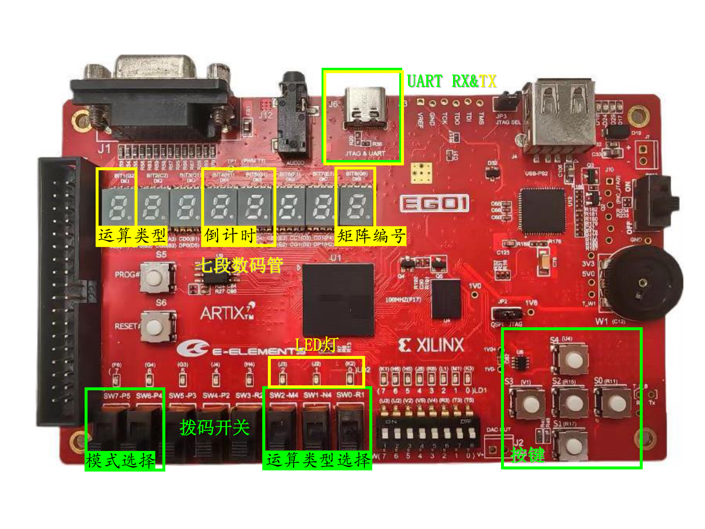
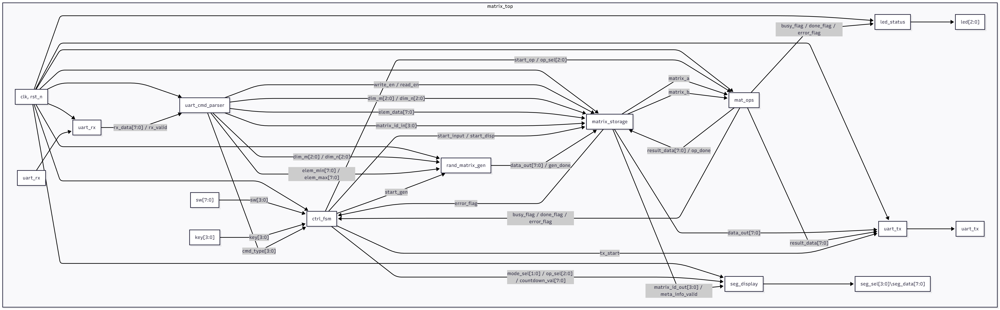

# CS207 FPGA Matrix Calculator – Architecture Design Document
基于 EGO1 FPGA 的矩阵计算器体系架构设计文档 - 12411038 游雨姗  12413438 张子墨

---

# 1. 输入输出设备

<figure>
<figcaption align="center">图 1. 矩阵计算器输入输出示意图</figcaption>
  
</figure>

本项目使用 EGO1 开发板上的拨码开关、按键、LED灯、七段数码管以及 UART 接口作为输入输出设备。

## 1.1 输入设备

### ① 拨码开关
- 功能 1：主菜单模式选择  P5(MSB) - P4(LSB)
  - | 代码 | 模式 |
    |-----|------|
    | 00 | 输入矩阵 |
    | 01 | 生成矩阵 |
    | 10 | 展示矩阵 |
    | 11 | 矩阵运算 |

- 功能 2：运算类型选择  M4(MSB) - N4 - R1(LSB)
  - | 代码 | 运算类型 |
    |-----|------|
    | 000 | T（转置） |
    | 001 | A（加法） |
    | 010 | b（标量乘） |
    | 011 | C（矩阵乘） |
    | 100 | J（卷积） |

### ② 按键
- | 按键 | 功能 |
    |-----|------|
    | U4 | 全局复位 |
    | V1 | 确认选择 |
    | R11 | 浏览 / 下一个矩阵 |
    | R17 | 返回上一级 |

### ③ UART RX（PC → FPGA）
- 接收矩阵输入命令（MATRIX … END）
- 接收生成指令（GEN …）
- 接收参数配置指令（CONFIG MAXCNT / CONFIG RANGE）

---

## 1.2 输出设备

### ① LED灯
| LED灯 | 功能 |
|-----|------|
| J3 | ERROR：输入非法、维度不匹配等 |
| J2 | BUSY：矩阵运算进行中 |
| K2 | DONE：运算成功完成 |

### ② 七段数码管
| 七段数码管 | 功能 |
|-----|------|
| G2 | 显示运算类型（T / A / b / C / J） |
| H1(MSB) - G1(LSB) | 显示倒计时（错误处理 5–15 s） |
| G6 | 显示当前矩阵编号 |

### ③ UART TX（FPGA → PC）
- 以文本格式输出矩阵
- 显示矩阵统计信息  
- 显示运算结果  

### ④ PC 端 UI
PC 端 UI 使用 Python + pyserial，实现：
- 图形化矩阵输入  
- 选择操作按钮（Input / Gen / Display / Operation）  
- 图形化展示矩阵  
- 发出与串口助手 **完全一致的文本指令**,保证“电路部分兼容串口调试助手测试”。

---

# 2. 项目结构

系统采用 **Control Path + Datapath 分离的模块化结构**。

## 2.1 项目结构图

<figure>
<figcaption align="center">图 2. 矩阵计算器顶层结构图</figcaption>
  
</figure>

---

## 2.2 模块汇总

| 模块名 | 输入端口 | 输出端口 | 功能 |
|-------------|-------------|--------------|----------|
| **matrix_top** | clk, rst_n, sw[7:0], key[3:0], uart_rx | uart_tx, led[2:0], seg_sel[3:0], seg_data[7:0] | 顶层模块，负责连接所有子模块与 I/O |
| **ctrl_fsm** | clk, rst_n, sw[3:0], key[3:0], error_flag, busy_flag, done_flag | mode_sel[1:0], op_sel[2:0], countdown_val[7:0], start_input, start_gen, start_disp, start_op | 顶层菜单有限状态机，实现四大功能模式切换 |
| **uart_rx** | clk, rst_n, uart_rx | rx_data[7:0], rx_valid | 串口接收字节流 |
| **uart_cmd_parser** | clk, rst_n, rx_data[7:0], rx_valid | cmd_type[3:0], dim_m[2:0], dim_n[2:0], elem_data[7:0], elem_min[7:0], elem_max[7:0], matrix_id_in[3:0], cfg_valid, write_en, read_en | 文本命令解析，提取 MATRIX / GEN / CONFIG 指令 |
| **matrix_storage** | clk, rst_n, write_en, read_en, dim_m[2:0], dim_n[2:0], data_in[7:0], matrix_id_in[3:0], result_data[7:0], op_done, start_input, start_disp | data_out[7:0], matrix_id_out[3:0], meta_info_valid, error_flag, matrix_a, matrix_b | RAM + 元数据表，用来管理矩阵的存储、读取和编号 |
| **rand_matrix_gen** | clk, rst_n, start_gen, dim_m[2:0], dim_n[2:0], elem_min[7:0], elem_max[7:0] | gen_done, data_out[7:0] | 随机矩阵生成 |
| **mat_ops** | clk, rst_n, start_op, op_sel[2:0], matrix_a, matrix_b, scalar_k | op_done, result_data[7:0], busy_flag, error_flag | 运算模块，实现矩阵 T/A/b/C/J 运算 |
| **seg_display** | clk, rst_n, mode_sel[1:0], op_sel[2:0], countdown_val[7:0], matrix_id_out[3:0] | seg_sel[3:0], seg_data[7:0] | 显示模式、运算符号、倒计时 |
| **led_status** | clk, rst_n, error_flag, busy_flag, done_flag | led[2:0] | LED 状态显示 |
| **uart_tx** | clk, rst_n, tx_start, tx_data[7:0] | uart_tx | 串口发送 |

---

# 3. 项目FSM

## 3.1 顶层FSM状态汇总

共 10 个主要状态：

- S_IDLE  
- S_MENU  
- S_INPUT  
- S_GEN  
- S_DISPLAY  
- S_OP_SELECT  
- S_OP_OPERAND  
- S_OP_RUN  
- S_OP_RESULT  
- S_ERROR  

## 3.2 状态转换图

<figure>
<figcaption align="center">图 3. 矩阵计算器顶层FSM状态转换图</figcaption>
  
</figure>